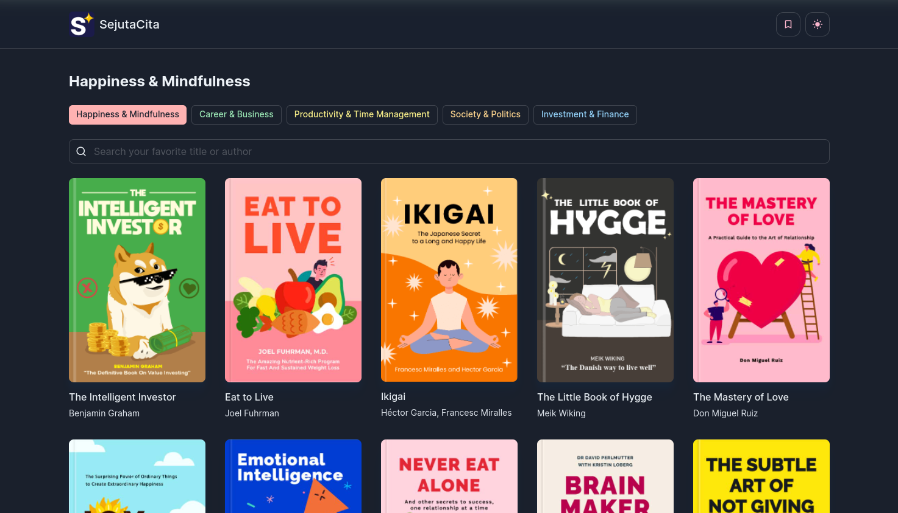
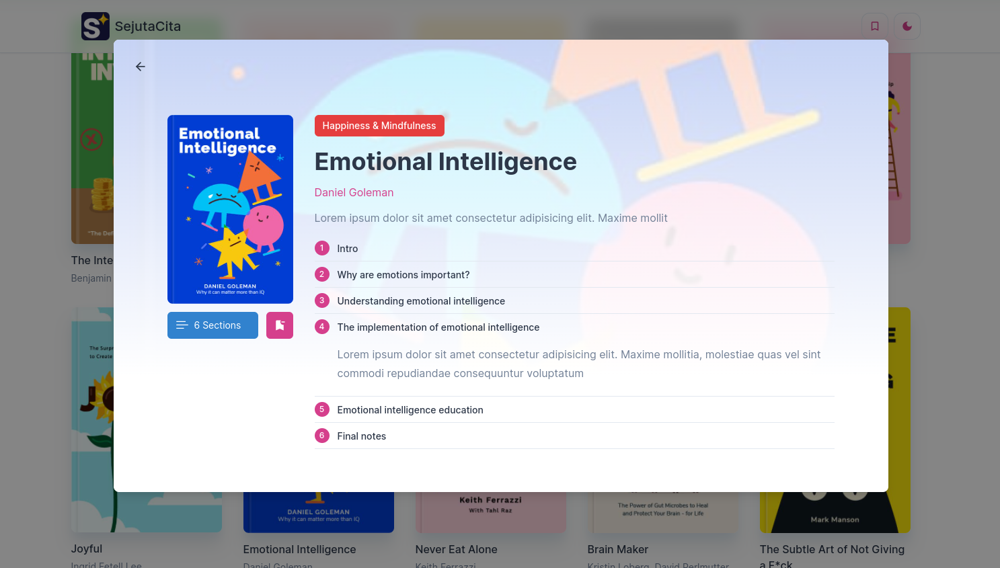
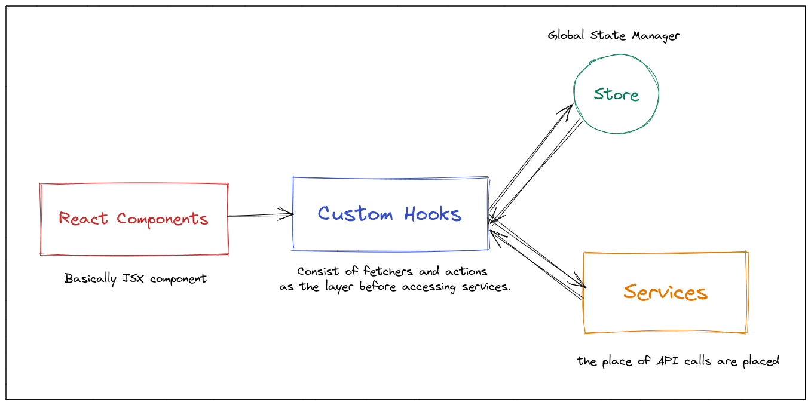
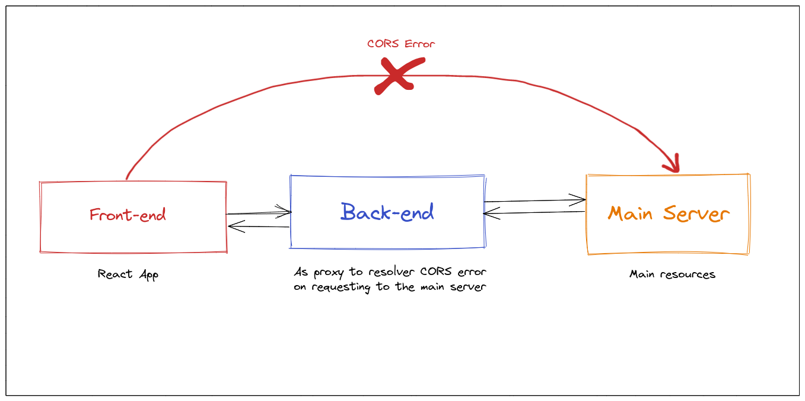

# SejutaCita Book List

Demo: [https://sc-books.vercel.app/](https://sc-books.vercel.app/)




## Tech Stack

This project was bootstrapped with:

- [React](https://reactjs.org/)
- [TypeScript](https://www.typescriptlang.org/)
- [Vite](https://vitejs.dev/)
- [Chakra UI](https://chakra-ui.com/)
- [Jest](https://jestjs.io/)
- [Recoil](https://recoiljs.org/)
- [ESLint](https://eslint.org/)

## Available Scripts

- `npm run dev` to run the app in development mode
- `npm run test` to run unit testings using Jest
- `npm run build` to build the project into static HTML files
- `npm run preview` to run build static HTML files
- `npm run fmt` to format and prettify codes

## How to run the app locally

1. Make sure you have installed `NodeJS` on your system.
2. Clone this repository.
3. Setup server app by creating a `.env` file into `server/` directory by duplicating the `.env.example` file.
4. Now run the server by running `yarn install && yarn start`.
5. Navigate to `client/` directory. Then create a `.env` file by duplicating the `.env.example` file.
6. Finally run `yarn install && yarn dev`.
7. Enjoy.

## Code Flow



### 1. React Components

Those are basically JSX components like button, input, navbar etc.

### 2. Custom Hooks

Those are used as the layer between React Component and Services to communicate. To keep the code clean, I decided to seperate theme instead of mixing every API calls and services into the components.

They usually return the service results and its calling state like `isLoading` and `error`. Custom Hooks could optionally call Store if the result of the service needs to be stored globally.

### 3. Store

Store is basically a global state manager to store states globally. Recoil is used as the global state manager in this project.

## App Flow



### 1. Front-end

The React app where the app is accessible for users.

### 2. Back-end

Since the main server blocked CORS access, so I decided to build a server app as the layer before accessing the main resources.

### 3. Main Server

The server where the book and category resources are placed.

## Back-end API Feedback

1. It would be better if the API provides better response data especially for pagination status. Example API response

```json
{
  "success": true,
  "pageInfo": {
    "hasNextPage": true,
    "totalPages": 100,
    "size": 10, // optional
    "page": 1 // optional
  },
  "books": [
    // books data here...
  ]
}
```

2. Better error message on something fails on the server. The current API response just shows blank response on request param is invalid. It might confuse team on client side who consumes the API. Example response

```json
{
  "success": false,
  "message": "categoryId required"
}
```

3. Since it's a public API, It would be better if CORS enabled on the server to enable access from any client origins.
